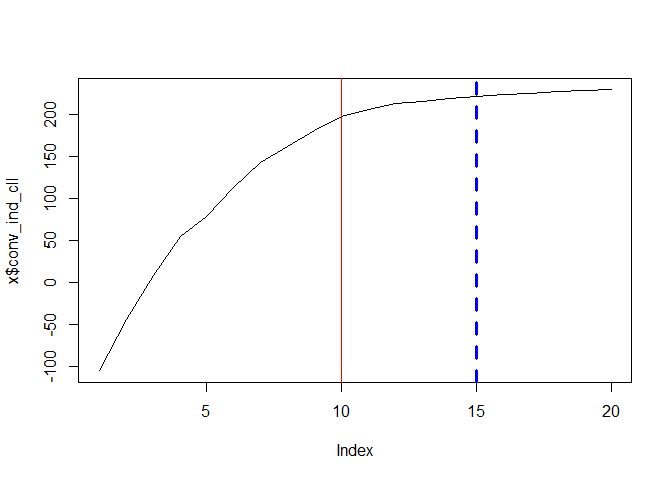

<!-- README.md is generated from README.Rmd. Please edit that file -->

# winputall

<!-- badges: start -->
<!-- badges: end -->

The goal of winputall is to provide cost input per crop. Using a
time-varying random parameters model developed in Koutchade et al.,
(2024) <https://hal.science/hal-04318163>, this package allows
allocating variable input costs among crops produced by farmers based on
panel data including information on input expenditure aggregated at the
farm level and acreage shares. It also considers in fairly way the
weighting data and can allow integrating time-varying and time-constant
control variables.

## Installation

You can install the development version of winputall like so:

``` r
devtools::install_gitlab("obafemi-philippe.koutchade/winputalloc", host = "https://forgemia.inra.fr")
```

## Example

This is a basic example which shows you how to estimate the population’s
parameters and calibrate the input uses per crop:

``` r
library("winputall")
data(my_winputall_data)
fit <- rpinpallEst(data = my_winputall_data,
                  id_time = c("id","year"),
                  total_input = "tx",
                  crop_acreage = c("s_crop1","s_crop2","s_crop3"),
                  distrib_method = "lognormal",
                  sim_method = "map_imh",
                  calib_method = "cmode",
                  saem_control = list(nb_SA = 10, nb_smooth = 10, estim_rdraw = 100))
#>   |                                                                              |                                                                      |   0%  |                                                                              |==                                                                    |   3%  |                                                                              |=====                                                                 |   7%  |                                                                              |=======                                                               |  10%  |                                                                              |=========                                                             |  13%  |                                                                              |============                                                          |  17%  |                                                                              |==============                                                        |  20%  |                                                                              |================                                                      |  23%  |                                                                              |===================                                                   |  27%  |                                                                              |=====================                                                 |  30%  |                                                                              |=======================                                               |  33%  |                                                                              |==========================                                            |  37%  |                                                                              |============================                                          |  40%  |                                                                              |==============================                                        |  43%  |                                                                              |=================================                                     |  47%  |                                                                              |===================================                                   |  50%  |                                                                              |=====================================                                 |  53%  |                                                                              |========================================                              |  57%  |                                                                              |==========================================                            |  60%  |                                                                              |============================================                          |  63%  |                                                                              |===============================================                       |  67%  |                                                                              |=================================================                     |  70%  |                                                                              |===================================================                   |  73%  |                                                                              |======================================================                |  77%  |                                                                              |========================================================              |  80%  |                                                                              |==========================================================            |  83%  |                                                                              |=============================================================         |  87%  |                                                                              |===============================================================       |  90%  |                                                                              |=================================================================     |  93%  |                                                                              |====================================================================  |  97%  |                                                                              |======================================================================| 100%
```

### Summary of The following command chows

You can get the summary of estimations (estimated population’s
parameters and corresponding standard errors and p-value ) using this
command:

``` r
summary(fit)
#> $beta_b
#>         Estimate     StdErr   t_value
#> Crop_1 0.7772689 0.06570165 11.830279
#> Crop_2 0.5297797 0.09782499  5.415586
#> Crop_3 1.2169040 0.07436374 16.364212
#> 
#> $diag_omega_b
#>          Estimate     StdErr   t_value
#> Crop_1 0.04603818 0.03148300 1.4623186
#> Crop_2 0.02615730 0.05356099 0.4883647
#> Crop_3 0.01296759 0.02344922 0.5530073
#> 
#> $diag_omega_e
#>          Estimate      StdErr  t_value
#> Crop_1 0.01615169 0.007719528 2.092316
#> Crop_2 0.03173457 0.022924172 1.384328
#> Crop_3 0.02160216 0.018489916 1.168321
#> 
#> $omega_u
#>         Estimate      StdErr  t_value
#> omega 0.03170063 0.008060302 3.932934
#> 
#> $beta_d
#>                  Estimate     StdErr     t_value
#> fid_time21994 -0.13215383 0.09445111 -1.39917707
#> fid_time21995  0.08932896 0.18016078  0.49582911
#> fid_time21996  0.04496308 0.17628944  0.25505262
#> fid_time21997  0.12736342 0.13923467  0.91473922
#> fid_time21998  0.17879365 0.15565737  1.14863594
#> fid_time21999  0.05106855 0.21358304  0.23910396
#> fid_time21994 -0.03070283 0.33257419 -0.09231875
#> fid_time21995 -0.07691945 0.28160530 -0.27314631
#> fid_time21996  0.10653954 0.35942967  0.29641274
#> fid_time21997  0.05947997 0.19357462  0.30727150
#> fid_time21998  0.19368997 0.33609837  0.57628954
#> fid_time21999  0.03223149 0.34468248  0.09351068
#> fid_time21994 -0.06017281 0.15470565 -0.38895031
#> fid_time21995 -0.01287218 0.22154472 -0.05810194
#> fid_time21996  0.08400325 0.24947392  0.33672157
#> fid_time21997  0.06573556 0.18051578  0.36415406
#> fid_time21998  0.16581007 0.33843364  0.48993378
#> fid_time21999  0.25704377 0.13631188  1.88570341
#> 
#> $sim_r_squared
#>         Estimate
#> sim_r2 0.9714626
```

### Check the convergence of estimation

To check the convergence, run for example:



### Distribution of estimated crop input uses

The following code shows you the distribution of crop input uses:

``` r
print(fit)
#> Call:
#> rpinpallEst(data = my_winputall_data, id_time = c("id", "year"), 
#>     total_input = "tx", crop_acreage = c("s_crop1", "s_crop2", 
#>         "s_crop3"), distrib_method = "lognormal", sim_method = "map_imh", 
#>     calib_method = "cmode", saem_control = list(nb_SA = 10, nb_smooth = 10, 
#>         estim_rdraw = 100))
#> 
#> Distribution of crop input uses:
#>          s_crop1_sh_X s_crop2_sh_X s_crop3_sh_X
#> Mean        2.3927492    1.8060243    3.6452724
#> Std.dev.    0.5446767    0.2543858    0.4654085
#> Min.        1.3568567    1.3006835    2.8313031
#> 1st Qu      1.9947475    1.6210932    3.3103693
#> Median      2.3124879    1.7635334    3.5749411
#> 3rd Qu      2.7370671    1.9608913    3.9342869
#> Max.        4.3532843    2.5381585    5.8771426
#> 
#> Mean by year of crop input uses:
#>   year s_crop1_sh_X s_crop2_sh_X s_crop3_sh_X
#> 1 1993     2.227616     1.702107     3.274500
#> 2 1994     1.989743     1.693060     3.183226
#> 3 1995     2.481038     1.585247     3.334575
#> 4 1996     2.367732     1.934447     3.686225
#> 5 1997     2.588016     1.835067     3.617081
#> 6 1998     2.704236     2.105305     3.998485
#> 7 1999     2.390864     1.786936     4.422814
```

### Estimated crop input uses

The following code shows the first parts of the estimated crops’ input
uses:

``` r
library("Matrix")
head(fit$xit_pred)
#>   id year s_crop1_sh_X s_crop2_sh_X s_crop3_sh_X
#> 1  1 1993     2.356701     1.699979     3.160915
#> 2  1 1994     1.956179     1.587084     2.831303
#> 3  1 1995     2.496381     1.549041     3.070641
#> 4  1 1996     2.632345     1.950286     3.556513
#> 5  1 1997     2.854353     1.833753     3.510459
#> 6  1 1998     2.953382     2.092654     3.853185
```
